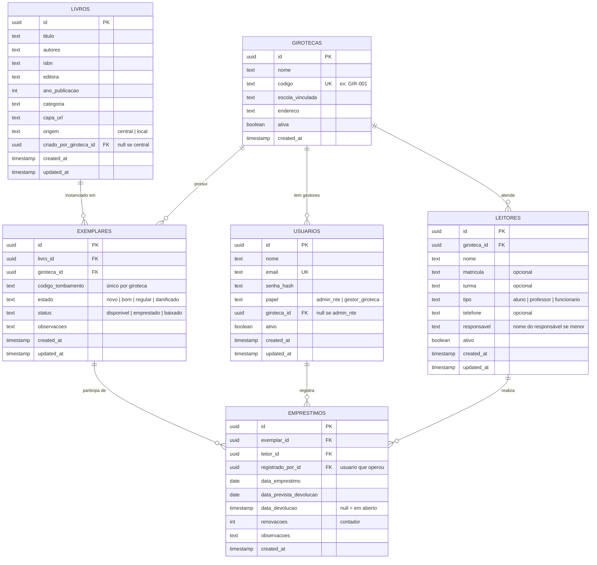

# Modelo de dados

Detalhamento do modelo de dados do Biblitec. Para o resumo das regras essenciais, veja [`CLAUDE.md`](../CLAUDE.md) seção 6.

## Diagrama de entidades



## A decisão mais importante: `livros` × `exemplares`

`livros` é o **catálogo bibliográfico** — uma entrada por obra, independentemente de onde ela está ou quantas cópias existem.

`exemplares` são as **cópias físicas** — cada uma pertence a uma giroteca específica e tem seu próprio código de tombamento (etiqueta colada no livro).

```
livros (catálogo)
  └── "Dom Casmurro" (id: abc-123, origem: central)
        └── exemplares
              ├── GIR-A-0042  (giroteca: Escola A, status: disponivel)
              ├── GIR-A-0043  (giroteca: Escola A, status: emprestado)
              └── GIR-B-0011  (giroteca: Escola B, status: disponivel)
```

Consequências práticas:

- Empréstimo liga a `exemplar_id`, nunca a `livro_id`.
- "Quantos livros de matemática essa giroteca tem" = contar `exemplares` com join em `livros`, filtrado por `giroteca_id`.
- Gestor adiciona livro novo = cria entrada em `livros` com `origem: local` + um `exemplar` vinculado à sua giroteca.

## Campo `origem` em `livros`

| Valor     | Significado                                            | Quem pode criar  |
| --------- | ------------------------------------------------------ | ---------------- |
| `central` | Acervo padrão da SEMEC, presente em todas as girotecas | Admin NTE        |
| `local`   | Adicionado por uma giroteca específica                 | Qualquer usuário |

Admin NTE pode editar manualmente um livro `local` para `central` se quiser padronizar. Promoção automática está fora do MVP.

## Estados dos exemplares

```
disponivel  →  emprestado   (ao criar empréstimo)
emprestado  →  disponivel   (ao processar devolução)
disponivel  →  baixado      (ao dar baixa manual com motivo)
emprestado  →  baixado      ← NÃO PERMITIDO (resolver empréstimo primeiro)
```

Motivos de baixa: `Perdido`, `Danificado`, `Descartado`, `Outro`. Sempre exigir motivo no formulário.

## Regras de negócio do empréstimo

Implementadas em `models/emprestimos.ts` com teste obrigatório:

- Exemplar com status `disponivel`.
- Leitor com `ativo = true`.
- Leitor com no máximo `MAX_EMPRESTIMOS_ATIVOS` (= 3) empréstimos em aberto.
- Leitor com empréstimo em atraso não pode fazer novo empréstimo.
- Prazo padrão: **14 dias** a partir da data do empréstimo.
- Máximo de **2 renovações** por empréstimo (`MAX_RENOVACOES = 2`).
- Não é possível renovar empréstimo já em atraso.

Limites numéricos sempre como constantes nomeadas — nunca hardcoded em múltiplos lugares.

## Multi-tenancy implícito

Não é multi-tenant clássico (sem schemas separados). É **dados compartilhados com filtro por `giroteca_id`**.

Se há 600 títulos no catálogo e 35 girotecas, o banco tem 600 linhas em `livros` e até 21.000 linhas em `exemplares` (600 × 35), cada uma com seu `giroteca_id`. Gestor da Giroteca A nunca enxerga exemplares da Giroteca B — mas ambas enxergam os mesmos 600 títulos.

| Tabela                    | Comportamento                                                                            |
| ------------------------- | ---------------------------------------------------------------------------------------- |
| `livros`                  | Catálogo global. Todos os títulos visíveis para todas. **Sem filtro** por `giroteca_id`. |
| `exemplares`              | **Sempre filtrado por `giroteca_id`** quando usuário não é admin.                        |
| `leitores`, `emprestimos` | **Sempre filtrado por `giroteca_id`** quando usuário não é admin.                        |
| `usuarios`                | Cada gestor tem `giroteca_id`; admin NTE tem `giroteca_id = null`.                       |

## Soft delete e integridade histórica

| Entidade      | Estratégia                                                  |
| ------------- | ----------------------------------------------------------- |
| `livros`      | Nunca deleta. Se sair do acervo, baixa todos os exemplares. |
| `exemplares`  | Status `baixado` em vez de DELETE.                          |
| `leitores`    | Campo `ativo = false`.                                      |
| `usuarios`    | Campo `ativo = false`.                                      |
| `emprestimos` | **Nunca deleta, jamais.** Histórico é sagrado.              |
| `girotecas`   | Campo `ativa = false`.                                      |

## Migrations

- Sempre rode `npm run db:generate` após alterar `db/schema.ts`. Nunca edite migrations geradas à mão.
- Migration que altera dados existentes precisa de migration de dados separada — Drizzle não gera, escreva à mão em `db/migrations/data/`.
- Se a migration vai demorar em produção (índice em tabela grande), use `CREATE INDEX CONCURRENTLY`.
- Migrations destrutivas (`DROP`, `TRUNCATE`) requerem aprovação explícita antes de rodar em ambiente não-efêmero.
